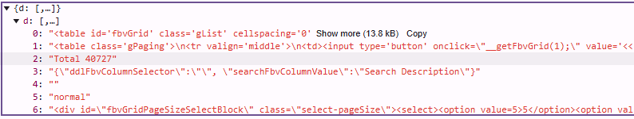

# UofT Course Evaluations

Students are able to find course evaluations via the [Quercus course eval page](https://q.utoronto.ca/courses/48756). This is a repository that compiles the data that data into csv
files for ease of analysis.

Can I use this for my JSC class? Who knows :3c

## Methodology

Taking a quick peek into the networks tab, we can see that the webpage sends a post request to this url here: `
https://course-evals.utoronto.ca/BPI/fbview-WebService.asmx/getFbvGrid`.

```javascript
// The actual code, some information is censored
fetch("https://course-evals.utoronto.ca/BPI/fbview-WebService.asmx/getFbvGrid", {
    "headers": {
        "accept": "*/*",
        "accept-language": "en-US,en;q=0.9",
        "content-type": "application/json; charset=UTF-8",
        "sec-ch-ua": "\"Not A(Brand\";v=\"8\", \"Chromium\";v=\"132\", \"Google Chrome\";v=\"132\"",
        "sec-ch-ua-mobile": "?0",
        "sec-ch-ua-platform": "\"Windows\"",
        "sec-fetch-dest": "empty",
        "sec-fetch-mode": "cors",
        "sec-fetch-site": "same-origin",
        "x-requested-with": "XMLHttpRequest"
    },
    "referrer": "https://course-evals.utoronto.ca/BPI/fbview.aspx?XXXXXXXX",
    "referrerPolicy": "strict-origin-when-cross-origin",
    "body": "{\"strUiCultureIn\":\"en\",\"datasourceId\":\"XXXX\",\"blockId\":\"XXXX\",\"subjectColId\":\"X\",\"subjectValue\":\"XXXX\",\"detailValue\":\"XXXX\",\"gridId\":\"XXXXX\",\"pageActuelle\":X,\"strOrderBy\":[\"col_1\",\"asc\"],\"strFilter\":[\"\",\"\",\"ddlFbvColumnSelectorLvl1\",\"\"],\"sortCallbackFunc\":\"__getFbvGrid\",\"userid\":\"XXXXXX\",\"pageSize\":\"X\"}",
    "method": "POST",
    "mode": "cors",
    "credentials": "include"
});
```

The response of this request looks something like this:

You can find an example response in `shards/example/1.json`

It looks like everything is handled server-sided, so we'll need to parse it on our end D: We have one saving grace though. The max option count seems to be 100... but doing some
custom requests, it seems like the number is unlimited. Don't be like me and try to request all 40727 of them; it won't go well.

I found the most success with a payload size of 1000. The way I did it was creating a custom function that sent requests off for the different page numbers and cycled through the
entire list. Then I just manually copied the results over to the shards folder. There isn't really a better way of doing this unless you want to create your own extension...

Run `preprocess.py` and `postprocess.py` to get your final csv's. I put my data (slightly cleaned up) in the `data` directory.

## Data Description
Other Data
* Dept - The course's department
* Course - The course's full name
* Term - The course's term (Fall/Winter/Summer)
* Year - The year the course is held in (not school year)
* Last Name - The last name of the professor
* Number Invited - How many people were in the course
* Number Responded - How many people filled out course evals

Column Codea:
* INS1 - I found this course intellectually stimulating
* INS2 - The course provided me with a deeper understanding of the subject matter
* INS3 - The instructor created a course atmosphere that was conducive to my learning
* INS4 - Course Projects, assignments, tests, and/or exams improved my understanding of the course material
* INS5 - Course Projects, assignments, tests, and/or exams provided me the opportunity for me to demonstrate an understanding of the course material
* INS6 - Overall, the quality of my learning experience in this course was:
* ARTSC1 - The instructor generated enthusiasm for learning in the course
* ARTSC2 - Compared to other courses, the worklaod of this course was:
* ARTSC3 - I would recommend this course to other students
* APSC001 - The course helped me improve my ability to formulate, analyze, and solve problems
* APSC002 - The instructor related course concepts to practical applications and/or current research
* APSC003 - Compared to other courses, the workload for this course was
* APSC004 - The instructor explained how the course concepts related to other courses
* APSC005 - The feedback I received on tests, assignments, labs, and/or projects provided guidance on how to improve my understanding of course materials
* APSC006 - The instructor explained what students are expected to learn in this course
* APSC007 - The course instructor delivered the course material in a clear and organized way
* APSC008 - N/A
* UTSC1 - The course inspired me to think further about the subject matter outside of class
* UTSC2 - Compared to other courses, the workload for this course was
* UTSC3 - I would recommend this course to other students